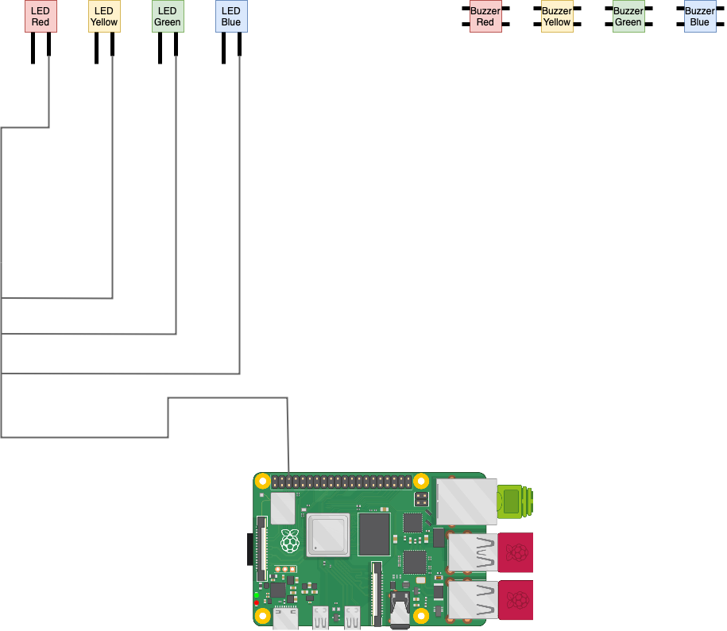
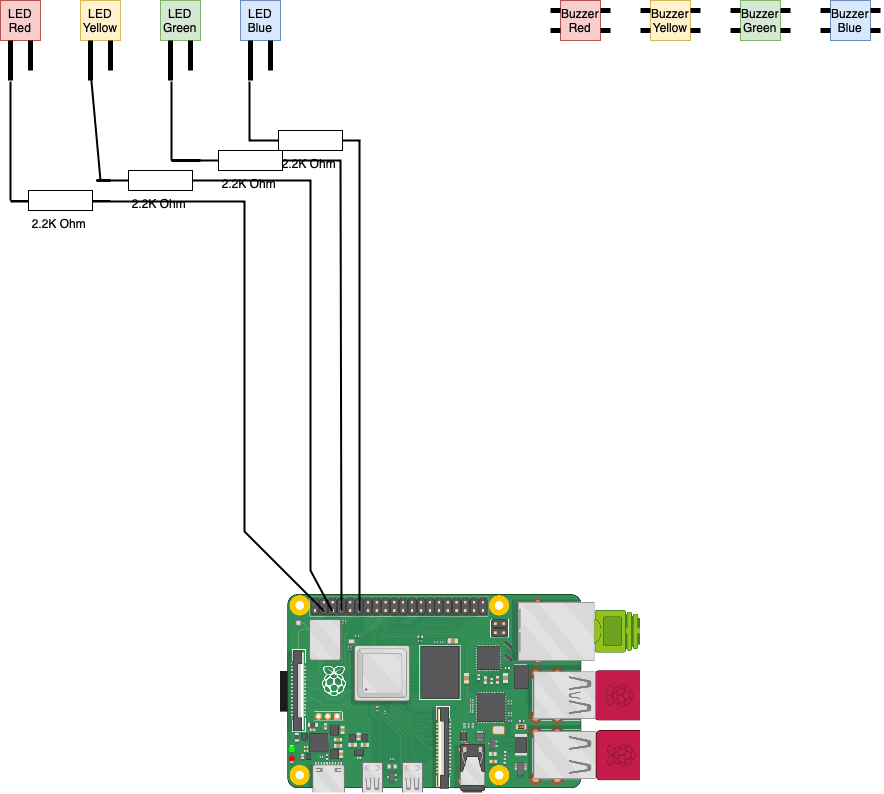
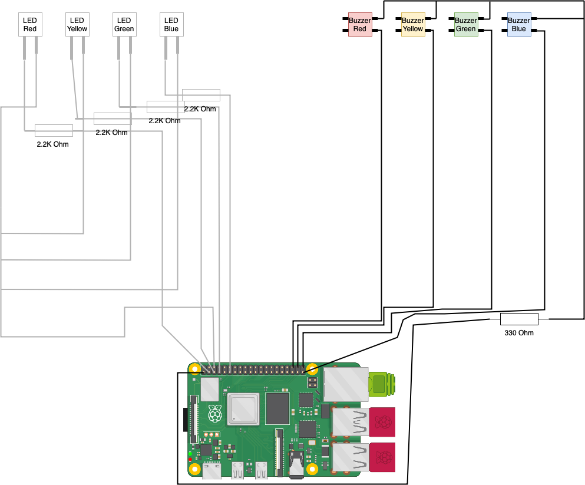

# Ein Buzzergame bauen
## 1. Material
- [Raspberry Pi Mini Computer](https://www.raspberrypi.com)
- [Led (Rot-Gelb-Grün-Blau)](https://www.amazon.de/Youmile-100er-Pack-rund-Leuchtdiode-Mischfarbe/dp/B07PZ75N67)
- [Buttons (Rot-Gelb-Grün-Blau)](https://www.digikey.de/de/products/detail/sparkfun-electronics/PRT-14460/7915747)
- [Verbindungskabel](https://www.amazon.de/Female-Female-Male-Female-Male-Male-Steckbrücken-Drahtbrücken-bunt/dp/B01EV70C78/ref=asc_df_B01EV70C78/?tag=googshopde-21&linkCode=df0&hvadid=310491639325&hvpos=&hvnetw=g&hvrand=11461513820173354466&hvpone=&hvptwo=&hvqmt=&hvdev=c&hvdvcmdl=&hvlocint=&hvlocphy=9042442&hvtargid=pla-362913641420&psc=1&th=1&psc=1&tag=&ref=&adgrpid=59900935617&hvpone=&hvptwo=&hvadid=310491639325&hvpos=&hvnetw=g&hvrand=11461513820173354466&hvqmt=&hvdev=c&hvdvcmdl=&hvlocint=&hvlocphy=9042442&hvtargid=pla-362913641420)
- [Steckplatte](https://www.kaufland.de/product/429289378/?kwd&source=pla&sid=41790452&gclid=Cj0KCQiAnNacBhDvARIsABnDa6-gY4RCjDM2pLt6dpFGdofF5kMT8Iouvvrn-3orQxaCjP3QdQzAJzkaAtBCEALw_wcB)
- 2.2K Ohm Wiederstand (4x)
- 330 Ohm Wiederstand (1x)
## 2. Aufbau
### 2.1 Leds
#### Schritt 1
<br>
#### Schritt 2
> **Warning**<br>
> Nichts Abstecken! Ich habe es bei der Abbildung ausgeblendet, da ihr es schon eingebaut habt.<br>
> 
### 2.2 Buttons

### 2.3 Einbauen
Baue nun alles in eine Kiste ein und Stecke den Rasperry Pi an den Strom.<br>
## 3. Website
Führe nun folgende Befehle im Terminal aus:<br>
```
sudo apt install apache2 -y
```
```
sudo apt install php -y
```
```
sudo cd /var/www/
```
```
sudo rm -r /html/
```
Lege nun den Ordner **html** aus diesem GitHub Projekt in den Ordner *www* hinein.<br>
Führe nun folgende Befehle aus:
```
cd /home/pi
```
```
chmod 777 /var/www/html/config.php
```
```
sudo service apache2 restart
```
## 4. Python Code
Führe nun folgenden Befehl aus:
```
nano buzzer_game.py
```
Führe dort folgenden Code ein:
```
import RPi.GPIO as GPIO
from time import sleep
import os

GPIO.setmode(GPIO.BCM)

rot = 2
gelb = 3
grün = 4
blau = 17

button_rot = 16
button_gelb = 20
button_grün = 21
button_blau = 19

poins_rot = 0
poins_gelb = 0
poins_grün = 0
poins_blau = 0

blocked = 0

GPIO.setup(rot, GPIO.OUT)
GPIO.setup(gelb, GPIO.OUT)
GPIO.setup(grün, GPIO.OUT)
GPIO.setup(blau, GPIO.OUT)
GPIO.setup(button_rot, GPIO.IN, pull_up_down=GPIO.PUD_DOWN)
GPIO.setup(button_gelb, GPIO.IN, pull_up_down=GPIO.PUD_DOWN)
GPIO.setup(button_grün, GPIO.IN, pull_up_down=GPIO.PUD_DOWN)
GPIO.setup(button_blau, GPIO.IN, pull_up_down=GPIO.PUD_DOWN)

GPIO.output(grün, GPIO.LOW)
GPIO.output(gelb, GPIO.LOW)
GPIO.output(rot, GPIO.LOW)
GPIO.output(blau, GPIO.LOW)

active = 1
hold = 0
wer = 0
masters = ['5', '10', '15', '20', '25', '30', '35', '40', '45', '50']

hardcore = input("Möchtest du den Hardcore Modus nutzen? (J / N) ")
master = input("Möchtest du den Master Modus nutzen? (J / N) ")
needed = input("Mit wie vielen Punkten hat man gewonnen? ")

runde = 0

while (active == 1):
  runde = runde + 1
  f = open("/var/www/html/config.php", "w")
  write = '<?php $title = "Runde ' + str(runde) + '"; $active = True; $poins_rot = "' + str(poins_rot) + '"; $poins_gelb = "' + str(poins_gelb) + '"; $poins_grün = "' + str(poins_grün) + '"; $poins_blau = "' + str(poins_blau) + '"; $blocked = "' + str(blocked) + '"; $pressed = "' + str(wer) + '"; ?>'
  f.write(write)
  f.close()
  GPIO.output(grün, GPIO.LOW)
  GPIO.output(gelb, GPIO.LOW)
  GPIO.output(rot, GPIO.LOW)
  GPIO.output(blau, GPIO.LOW)
  wer = 0
  x_null = input("Drücke ENTER zum starten! ")
  sleep(0.1)
  wait = 1
  f = open("/var/www/html/config.php", "w")
  write = '<?php $title = "Runde ' + str(runde) + ' - Jetzt drücken!"; $active = True; $poins_rot = "' + str(poins_rot) + '"; $poins_gelb = "' + str(poins_gelb) + '"; $poins_grün = "' + str(poins_grün) + '"; $poins_blau = "' + str(poins_blau) + '"; $blocked = "' + str(blocked) + '"; $pressed = "' + str(wer) + '"; ?>'
  f.write(write)
  f.close()
  if blocked != "grün":
    GPIO.output(grün, GPIO.HIGH)
  if blocked != "gelb":
    GPIO.output(gelb, GPIO.HIGH)
  if blocked != "rot":
    GPIO.output(rot, GPIO.HIGH)
  if blocked != "blau":
    GPIO.output(blau, GPIO.HIGH)
  wer = 0
  if master == "J":
    for x in masters:
      if int(runde) == int(x):
        print("MASTER FRAGE: 3 Punkte!")
        f = open("/var/www/html/config.php", "w")
        write = '<?php $title = "Masterfrage - Runde ' + str(runde) + ' - Jetzt drücken!"; $active = True; $poins_rot = "' + str(poins_rot) + '"; $poins_gelb = "' + str(poins_gelb) + '"; $poins_grün = "' + str(poins_grün) + '"; $poins_blau = "' + str(poins_blau) + '"; $blocked = "' + str(blocked) + '"; $pressed = "' + str(wer) + '"; ?>'
        f.write(write)
        f.close()
        for x in range(5):
          GPIO.output(grün, GPIO.HIGH)
          sleep(0.1)
          GPIO.output(grün, GPIO.LOW)
          sleep(0.1)
          GPIO.output(gelb, GPIO.HIGH)
          sleep(0.1)
          GPIO.output(gelb, GPIO.LOW)
          sleep(0.1)
          GPIO.output(rot, GPIO.HIGH)
          sleep(0.1)
          GPIO.output(rot, GPIO.LOW)
          sleep(0.1)
          GPIO.output(blau, GPIO.HIGH)
          sleep(0.1)
          GPIO.output(blau, GPIO.LOW)
          sleep(0.1)
        if blocked != "grün":
          GPIO.output(grün, GPIO.HIGH)
        if blocked != "gelb":
          GPIO.output(gelb, GPIO.HIGH)
        if blocked != "rot":
          GPIO.output(rot, GPIO.HIGH)
        if blocked != "blau":
          GPIO.output(blau, GPIO.HIGH)
  but_rot_abfrage = GPIO.input(button_rot)
  but_gelb_abfrage = GPIO.input(button_gelb)
  but_grün_abfrage = GPIO.input(button_grün)
  but_blau_abfrage = GPIO.input(button_blau)
  while (wait == 1):
    if blocked != "rot":
      but_rot_abfrage = GPIO.input(button_rot)
    if blocked != "gelb":
      but_gelb_abfrage = GPIO.input(button_gelb)
    if blocked != "grün":
      but_grün_abfrage = GPIO.input(button_grün)
    if blocked != "blau":
      but_blau_abfrage = GPIO.input(button_blau)
    if but_rot_abfrage == GPIO.HIGH:
      print("Rot war am schnellsten!")
      wait = 0
      blocked = 0
      wer = "rot"
      f = open("/var/www/html/config.php", "w")
      write = '<?php $title = "Runde ' + str(runde) + '"; $active = True; $poins_rot = "' + str(poins_rot) + '"; $poins_gelb = "' + str(poins_gelb) + '"; $poins_grün = "' + str(poins_grün) + '"; $poins_blau = "' + str(poins_blau) + '"; $blocked = "' + str(blocked) + '"; $pressed = "' + str(wer) + '"; ?>'
      f.write(write)
      f.close()
      GPIO.output(grün, GPIO.LOW)
      GPIO.output(gelb, GPIO.LOW)
      GPIO.output(blau, GPIO.LOW)
      for x in range(10):
         GPIO.output(rot, GPIO.LOW)
         sleep(0.2)
         GPIO.output(rot, GPIO.HIGH)
         sleep(0.2)
    elif but_gelb_abfrage == GPIO.HIGH:
      print("Gelb war am schnellsten!")
      wait = 0
      blocked = 0
      wer = "gelb"
      f = open("/var/www/html/config.php", "w")
      write = '<?php $title = "Runde ' + str(runde) + '"; $active = True; $poins_rot = "' + str(poins_rot) + '"; $poins_gelb = "' + str(poins_gelb) + '"; $poins_grün = "' + str(poins_grün) + '"; $poins_blau = "' + str(poins_blau) + '"; $blocked = "' + str(blocked) + '"; $pressed = "' + str(wer) + '"; ?>'
      f.write(write)
      f.close()
      GPIO.output(grün, GPIO.LOW)
      GPIO.output(rot, GPIO.LOW)
      GPIO.output(blau, GPIO.LOW)
      for x in range(10):
         GPIO.output(gelb, GPIO.LOW)
         sleep(0.2)
         GPIO.output(gelb, GPIO.HIGH)
         sleep(0.2)
    elif but_grün_abfrage == GPIO.HIGH:
      print("Grün war am schnellsten!")
      wait = 0
      blocked = 0
      wer = "grün"
      f = open("/var/www/html/config.php", "w")
      write = '<?php $title = "Runde ' + str(runde) + '"; $active = True; $poins_rot = "' + str(poins_rot) + '"; $poins_gelb = "' + str(poins_gelb) + '"; $poins_grün = "' + str(poins_grün) + '"; $poins_blau = "' + str(poins_blau) + '"; $blocked = "' + str(blocked) + '"; $pressed = "' + str(wer) + '"; ?>'
      f.write(write)
      f.close()
      GPIO.output(rot, GPIO.LOW)
      GPIO.output(gelb, GPIO.LOW)
      GPIO.output(blau, GPIO.LOW)
      for x in range(10):
         GPIO.output(grün, GPIO.LOW)
         sleep(0.2)
         GPIO.output(grün, GPIO.HIGH)
         sleep(0.2)
    elif but_blau_abfrage == GPIO.HIGH:
      print("Blau war am schnellsten!")
      wait = 0
      blocked = 0
      wer = "blau"
      f = open("/var/www/html/config.php", "w")
      write = '<?php $title = "Runde ' + str(runde) + '"; $active = True; $poins_rot = "' + str(poins_rot) + '"; $poins_gelb = "' + str(poins_gelb) + '"; $poins_grün = "' + str(poins_grün) + '"; $poins_blau = "' + str(poins_blau) + '"; $blocked = "' + str(blocked) + '"; $pressed = "' + str(wer) + '"; ?>'
      f.write(write)
      f.close()
      GPIO.output(grün, GPIO.LOW)
      GPIO.output(gelb, GPIO.LOW)
      GPIO.output(rot, GPIO.LOW)
      for x in range(10):
         GPIO.output(blau, GPIO.LOW)
         sleep(0.2)
         GPIO.output(blau, GPIO.HIGH)
         sleep(0.2)
  f = open("/var/www/html/config.php", "w")
  write = '<?php $title = "Runde ' + str(runde) + '"; $active = True; $poins_rot = "' + str(poins_rot) + '"; $poins_gelb = "' + str(poins_gelb) + '"; $poins_grün = "' + str(poins_grün) + '"; $poins_blau = "' + str(poins_blau) + '"; $blocked = "' + str(blocked) + '"; $pressed = "' + str(wer) + '"; ?>'
  f.write(write)
  f.close()
  punkte = 1
  input_1 = input("Hat " + wer + " die Frage richtig beantwortet? (J / N) ")
  if master == "J":
    for x in masters:
      if int(runde) == int(x):
        punkte = 3
  if input_1 == "J":
    if wer == "rot":
      poins_rot = poins_rot + punkte
      print(wer + " hat jetzt " + str(poins_rot) + " Punkte!")
    if wer == "gelb":
      poins_gelb = poins_gelb + punkte
      print(wer + " hat jetzt " + str(poins_gelb) + " Punkte!")
    if wer == "grün":
      poins_grün = poins_grün + punkte
      print(wer + " hat jetzt " + str(poins_grün) + " Punkte!")
    if wer == "blau":
      poins_blau = poins_blau + punkte
      print(wer + " hat jetzt " + str(poins_blau) + " Punkte!")
  if input_1 == "N":
    if hardcore == "J":
      blocked = wer
    else:
      print("Der Button wird nicht gesperrt, da Hardcore deaktiviert ist!")
  f = open("/var/www/html/config.php", "w")
  write = '<?php $title = "Nächste Runde startet..."; $active = True; $poins_rot = "' + str(poins_rot) + '"; $poins_gelb = "' + str(poins_gelb) + '"; $poins_grün = "' + str(poins_grün) + '"; $poins_blau = "' + str(poins_blau) + '"; $blocked = "' + str(blocked) + '"; $pressed = "' + str(wer) + '"; ?>'
  f.write(write)
  f.close()
  if int(needed) <= int(poins_rot):
    print("Rot hat gewonnen!")
    f = open("/var/www/html/config.php", "w")
    write = '<?php $title = "Rot hat gewonnnen!"; $active = True; $poins_rot = "' + str(poins_rot) + '"; $poins_gelb = "' + str(poins_gelb) + '"; $poins_grün = "' + str(poins_grün) + '"; $poins_blau = "' + str(poins_blau) + '"; $blocked = "' + str(blocked) + '"; $pressed = "' + str(wer) + '"; ?>'
    f.write(write)
    f.close()
    for x in range(30):
      GPIO.output(rot, GPIO.LOW)
      sleep(0.2)
      GPIO.output(rot, GPIO.HIGH)
      sleep(0.2)
    active = 0
  if int(needed) <= int(poins_gelb):
    print("Gelb hat gewonnen!")
    f = open("/var/www/html/config.php", "w")
    write = '<?php $title = "Gelbb hat gewonnnen!"; $active = True; $poins_rot = "' + str(poins_rot) + '"; $poins_gelb = "' + str(poins_gelb) + '"; $poins_grün = "' + str(poins_grün) + '"; $poins_blau = "' + str(poins_blau) + '"; $blocked = "' + str(blocked) + '"; $pressed = "' + str(wer) + '"; ?>'
    f.write(write)
    f.close()
    for x in range(30):
      GPIO.output(gelb, GPIO.LOW)
      sleep(0.2)
      GPIO.output(gelb, GPIO.HIGH)
      sleep(0.2)
    active = 0
  if int(needed) <= int(poins_grün):
    print("Grün hat gewonnen!")
    f = open("/var/www/html/config.php", "w")
    write = '<?php $title = "Grün hat gewonnnen!"; $active = True; $poins_rot = "' + str(poins_rot) + '"; $poins_gelb = "' + str(poins_gelb) + '"; $poins_grün = "' + str(poins_grün) + '"; $poins_blau = "' + str(poins_blau) + '"; $blocked = "' + str(blocked) + '"; $pressed = "' + str(wer) + '"; ?>'
    f.write(write)
    f.close()
    for x in range(30):
      GPIO.output(grün, GPIO.LOW)
      sleep(0.2)
      GPIO.output(grün, GPIO.HIGH)
      sleep(0.2)
    active = 0
  if int(needed) <= int(poins_blau):
    print("Blau hat gewonnen!")
    f = open("/var/www/html/config.php", "w")
    write = '<?php $title = "Blau hat gewonnnen!"; $active = True; $poins_rot = "' + str(poins_rot) + '"; $poins_gelb = "' + str(poins_gelb) + '"; $poins_grün = "' + str(poins_grün) + '"; $poins_blau = "' + str(poins_blau) + '"; $blocked = "' + str(blocked) + '"; $pressed = "' + str(wer) + '"; ?>'
    f.write(write)
    f.close()
    for x in range(30):
      GPIO.output(blau, GPIO.LOW)
      sleep(0.2)
      GPIO.output(blau, GPIO.HIGH)
      sleep(0.2)
    active = 0

GPIO.cleanup()
f = open("/var/www/html/config.php", "w")
write = '<?php $active = False; $poins_rot = "0"; $poins_gelb = "0"; $poins_grün = "0"; $poins_blau = "0"; $blocked = ""; $pressed = ""; ?>'
f.write(write)
f.close()
```
## 5. So wird gespielt
1. Öffne deine Website: http://[IP]<br>
2. Starte das Spiel:<br>
```sudo python3 buzzer_game.py```<br>
3. Möchtest du im Hardcode Modus spielen? (Hardcode bedeutet, dass wenn eine Frage falsch beantwortet wird, man für 1 Frage gesperrt wird)<br>
4. Master Modus? (Bedeutet, dass alle 5 Fragen es 3 Punkte gibt)<br>
5. beanntworte die Restlichen Fragen<br>
6. ... und jetzt viel Spaß beim Spielen!<br>

