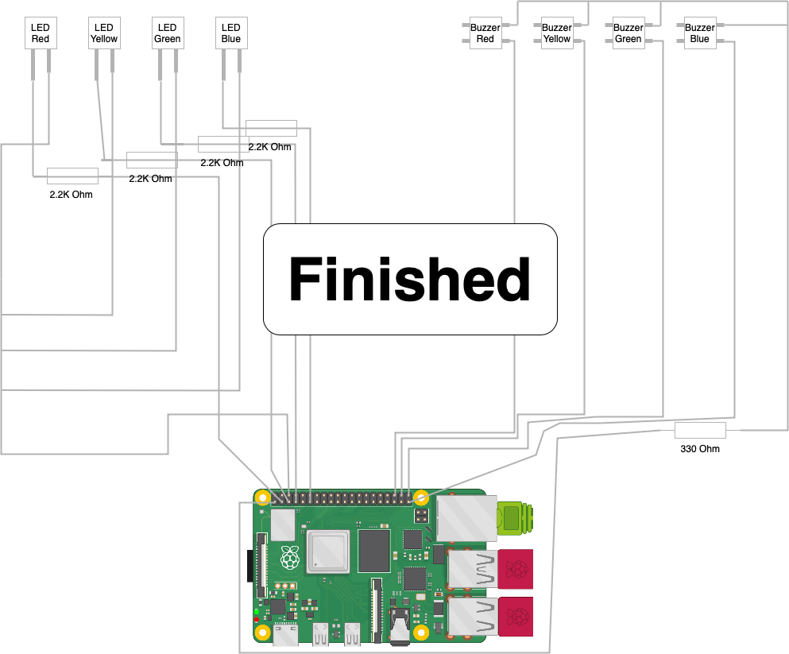

# Ein Buzzergame bauen
## 1. Material
- [Raspberry Pi Mini Computer](https://www.raspberrypi.com)
- [Led (Rot-Gelb-Grün-Blau)](https://www.amazon.de/Youmile-100er-Pack-rund-Leuchtdiode-Mischfarbe/dp/B07PZ75N67)
- [Buttons (Rot-Gelb-Grün-Blau)](https://www.digikey.de/de/products/detail/sparkfun-electronics/PRT-14460/7915747)
- [Verbindungskabel](https://www.amazon.de/Female-Female-Male-Female-Male-Male-Steckbrücken-Drahtbrücken-bunt/dp/B01EV70C78/ref=asc_df_B01EV70C78/?tag=googshopde-21&linkCode=df0&hvadid=310491639325&hvpos=&hvnetw=g&hvrand=11461513820173354466&hvpone=&hvptwo=&hvqmt=&hvdev=c&hvdvcmdl=&hvlocint=&hvlocphy=9042442&hvtargid=pla-362913641420&psc=1&th=1&psc=1&tag=&ref=&adgrpid=59900935617&hvpone=&hvptwo=&hvadid=310491639325&hvpos=&hvnetw=g&hvrand=11461513820173354466&hvqmt=&hvdev=c&hvdvcmdl=&hvlocint=&hvlocphy=9042442&hvtargid=pla-362913641420)
- [Steckplatte](https://www.kaufland.de/product/429289378/?kwd&source=pla&sid=41790452&gclid=Cj0KCQiAnNacBhDvARIsABnDa6-gY4RCjDM2pLt6dpFGdofF5kMT8Iouvvrn-3orQxaCjP3QdQzAJzkaAtBCEALw_wcB)
- 2.2K Ohm Wiederstand (4x)
- 330 Ohm Wiederstand (1x)
## 2. Aufbau
### 2.1 Leds
#### Schritt 1
 
#### Schritt 2
> **Warning** 
> Nichts Abstecken! Ich habe es bei der Abbildung ausgeblendet, da ihr es schon eingebaut habt. 
> 
### 2.2 Buttons

### 2.3 Einbauen
Baue nun alles in eine Kiste ein und Stecke den Rasperry Pi an den Strom. 

